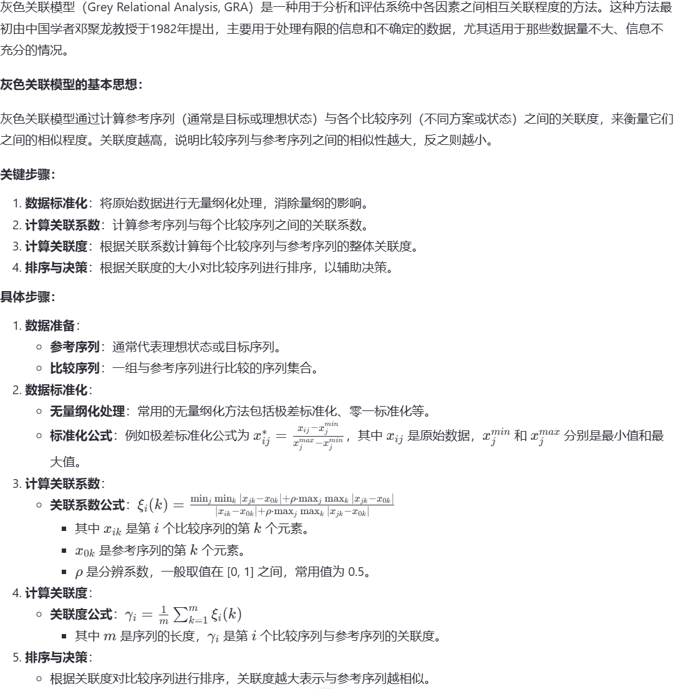

by：侯颛

- [MATLAB](#matlab)
  - [快捷键](#快捷键)
  - [语法](#语法)
    - [数据类型](#数据类型)
      - [向量和矩阵](#向量和矩阵)
      - [字符](#字符)
      - [元胞数组](#元胞数组)
      - [结构体](#结构体)
      - [时间数据（略）](#时间数据略)
    - [关键字](#关键字)
      - [if语句](#if语句)
      - [switch语句](#switch语句)
      - [for语句](#for语句)
      - [while语句](#while语句)
      - [try-catch语句](#try-catch语句)
      - [classdef和spmd（略）](#classdef和spmd略)
    - [函数](#函数)
      - [一般函数使用](#一般函数使用)
      - [return,global,presistent的使用](#returnglobalpresistent的使用)
      - [局部函数和嵌套函数的使用](#局部函数和嵌套函数的使用)
      - [函数句柄（略）](#函数句柄略)
    - [正则表达式](#正则表达式)
    - [其他](#其他)
      - [格式](#格式)
      - [注释](#注释)
      - [行延续](#行延续)
      - [clc与clear](#clc与clear)
      - [tic-toc计时](#tic-toc计时)
      - [pause暂停](#pause暂停)
      - [警告开局/关闭](#警告开局关闭)
      - [whos和class](#whos和class)
  - [数据可视化（绘图）](#数据可视化绘图)
    - [基本用法](#基本用法)
    - [图形对象句柄（略）](#图形对象句柄略)
  - [网络爬虫](#网络爬虫)
    - [静态网站爬取](#静态网站爬取)
    - [动态网站爬取](#动态网站爬取)
  - [库函数](#库函数)
    - [输入输出](#输入输出)
    - [数值运算](#数值运算)
    - [统计相关](#统计相关)
    - [逻辑运算](#逻辑运算)
    - [向量、矩阵相关](#向量矩阵相关)
    - [集合相关](#集合相关)
    - [字符相关](#字符相关)
    - [函数相关](#函数相关)
    - [元胞数组相关](#元胞数组相关)
    - [正则表达式相关](#正则表达式相关)
    - [绘图相关](#绘图相关)
    - [其他函数](#其他函数)
  - [模型算法](#模型算法)
    - [模拟退火](#模拟退火)
    - [蒙特卡罗](#蒙特卡罗)
    - [斯皮尔曼(spearman)和皮尔逊(pearson)相关系数](#斯皮尔曼spearman和皮尔逊pearson相关系数)
    - [K-means(++)聚类算法](#k-means聚类算法)
    - [自相关系数ACF](#自相关系数acf)
    - [时间序列预测](#时间序列预测)
    - [灰色关联](#灰色关联)
    - [插值与拟合](#插值与拟合)
    - [K-S检验](#k-s检验)

# MATLAB
<font size = 4 color = #00ffff>首先应该说明，通过破解获取的盗版matlab仅能用于个人学习，用于数学建模比赛问题不大，但是**绝对不能**用于其他的科研论文！！！</font>

**本篇基于 MATLAB R2024a**

## 快捷键
Ctrl + N 新建脚本

Ctrl + S 保存脚本\
`matlab文件，有.m(脚本) .mlx(实时脚本) .mat(数据文件)等，命名不可用中文，且要以字母开头`

Ctrl + E 在实时脚本中，将文本转化为代码（或反之）

Ctrl + Alt + Enter 分节\
Ctrl + ↑/↓ 转到上/下一节

F5 运行整个脚本\
Ctrl + Shift + Enter 运行当前行\
Ctrl + Enter 运行当前节\
`也可以直接在命令行输入脚本名称来运行`

Ctrl + R 添加注释\
Ctrl + T 取消注释\
Ctrl + J 注释换行

Ctrl + I 自动缩进

Ctrl + C 中止程序

Ctrl + F / Ctrl + H 查找和替换

## 语法
与C语言相似，句末 ‘ ; ’表示分行，并且该行结果不会在命令行输出，而变量的使用上又与python类似，不需要提前声明类型

提示：
```
% matlab没有++运算，只能+=
i += 1;
% 乘方和点乘方
a = a.^b;     % 对a的每个元素都做乘方运算
A = A^b;      % 若A是矩阵，则做矩阵乘法；若是标量则与点乘方相同
% 其他点运算
C = A.*B;     % 对应元素相乘
C = A*B;      % 矩阵乘法
C = A./B;     % 对应元素相除
C = A/B;      % 右乘B的逆矩阵
``` 

### 数据类型
命名规范与脚本一致，同时不能与关键字同名 `最好也不要与库函数同名`\
查看所有关键字：
```
iskeyword
```

其他：
```
inf/-inf    % 表示正/负无穷
NaN         % 不定值/缺失值
i / j       % 虚数单位，会自动区分i是否为虚数单位，因此可以自定义i
eps         % 浮点精度，一个很小的正数，即数学中的epsilon
```

句柄类型见目录其他位置，不单独列入数据类型中
#### 向量和矩阵
类似C语言中的数组
```
a = [1 3 5]
a = [1,3,5]
% 行向量
a = [1;3;5]
% 列向量

a = [S:step:E] % 起始值:步长:终了值
% 按步长创建，步长可以正负，为1可以省略，为0返回空向量
```
注意：matlab中数组的下标 **从1开始**

可以使用end代替数组的最后一个位置
```
a = [1:4]
a(2:end-1)  % 输出2 3
```

向量的修改与删除
```
a = [1 2 3 4 5]
a([1,3]) = [0 0]  % 把第一第三位置上的1 3改为0 0

a(1) = []         % 删除第一位置上的1
a(end-1:end) = [] % 删除最后一位和倒数第二位
a(a<=3) = []      % 删除所有小于3的元素
% a<=3返回的是逻辑矩阵，相当于按逻辑矩阵进行索引

b = [1 2 3 4 5]
b(7) = 7          % 空位自动补0，第七个位置为7
```

---

矩阵
```
a = [1 2 3;4 5 6;7 8 9]
b = [1 2 3      % b = [1 2 3;
     4 5 6      %      4 5 6;
     7 8 9]     %      7 8 9]

a([1,2],[2,3])  % 输出[2 3;
                %      5 6]
b(1,:)          % 输出[1 2 3]  (第一行)
b(:)            % 输出[1 2 3 4 5 6 7 8 9]
```
类似二维数组可以当作一维数组按行线性调用（比如3×3数组的a(4) = a(1,1)），matlab中的矩阵也可以线性调用。不同的是其线性方向是按列遍历，即先列后行。

矩阵的修改和向量类似，核心在于被修改的位置要与所赋值的数量对应，拓展矩阵时默认填0。删除元素时，赋值 ‘[]’ 即可，且应按整行整列删除。
```
a = [1 2 3;4 5 6;7 8 9]

a([1,2],[2,3]) = [0 0;0 0]  % 赋值
a(:,1) = []                 % 删除第一列
```

矩阵还可以按逻辑矩阵调用
```
L = [1 0 0;
     0 0 1;
     0 1 0]

A = [1 2 3;
     4 5 6;
     7 8 9]

% A(L) = [1;8;6]
```

#### 字符
matlab中字符默认使用UTF-16编码

单字符，可以按照ASCII码当作整型运算，且加减结果是ASCII码值，而不是字符
```
c = 'a'
c = '啊'

c = 'a' + 1           % c = 98
'a' < 'b'             % 返回1
```

字符向量，其实是向量的一种形式，向量的特性它都有
```
c = ['a','b','c']
c = ['a':'c']
c = 'abc'             % 简写形式

c = ['a';'b';'c']     % 字符列向量
```

字符矩阵，和普通矩阵一样
```
c = ['a','b','c';
     'd','e','f']
c = ['abc';
     'def']
```

1. 多个单引号连用时会被自动省略，如'a''''b'，会识别为'a' 'b'
2. 用newline表示换行
   ```
   c = ['a' 'b' 'c' newline 'd' 'e']
   % 输出[abc
   %      de]
   ```
3. 在较新的版本中，用双引号围起表示字符串，与字符向量做区分。两种经常可以混用，因此需要注意区分（比较建议用字符向量）

#### 元胞数组
可以存储不同的数据类型和不同大小的数据类型。用大括号括起来表示
```
a = {1,2,3}
b = {[1,2],"3",4}
c = {1,"2";3,4}
```
引用时
```
% a{1} = 1          a(1) = {1}
% b{1} = [1,2]
% b{2} = "3"
% c{2,1} = 3        c(2,1) = {3}
```
链式索引规则，小括号只能出现在最后，因此，修改或删除元胞数组时，需要注意使用大括号还是小括号
```
a = {1,[2,3;4,5],'awa',{2,'ha'}}
% a{2}(2,1) = 4
% a{3}(2) = w
% a{4}{2}(1) = 'h'

a{1} = 2        % 大括号修改
a(1) = {3}      % 小括号修改
% a(1) = 2  报错，等号右侧需要为元胞数组
% a{1} = {2}  不报错，但结果会变成嵌套的元胞数组

a{1} = []       % 大括号删除，只删除元素
a(1) = []       % 小括号删除，删除元素和元胞数组（多维元胞数组往往会破坏长度导致报错）
```
元胞数组的拼接
```
a = {1,2,3}
b = {'a','b','c'}

c = [a;b]
% c = {1,2,3,'a','b','c'}
% 与使用cat函数的结果相同，相当于拼接了元素，要求对应行或列登长

d = {a,b}
% d = {{1,2,3},{'a','b','c'}}
% 相当于创建了嵌套的元胞数组
```

1. matlab将元胞数组的每一个元素都视为一个独立的元胞，因而可以独立地修改，不会影响整体的数据结构

#### 结构体
类似C语言中的结构体数组

结构体和结构体数组的创建
```
s.m1 = 1;
% 创建结构体并建立一个成员
s.m2 = 'a';
% 继续添加成员
s(2).m1 = [1,2];
% 创建结构体数组，此时，前两个语句相当于对s(1)进行赋值。允许创建多维结构体数组
```
```
s1 = struct('字段1',[1,2,3],'字段2',['a','b','c']);
% 创建单个结构体，s1.字段1 = [1,2,3]  s1.字段2 = ['a','b','c']

s2 = struct('字段1',{1,2,3},'字段2',{'a','b','c'});
% 创建结构体数组，s2(1).字段1 = 1  s2(2).字段2 = 'b'

s3 = struct('字段1',{1,2,3},'字段2','a');
% 创建结构体数组，s3(1).字段2 = a  s3(2).字段2 = 'a'
```
```
c1 = 'name'
s4.(c1) = "000"
% s4.name = "000"
```
1. 注意：m1只是字段名，在同个结构体数组的不同结构体中，其对应值不一定是同一种类型。因此，编程时应尽量保证使用同一种类型，或者使用表格类型
2. 使用struct函数创建结构体数组时，如果有字段对应的value参数类型不统一（比如不都是非标量元胞数组），按如s3所示方式创建结构体数组
3. 结构体的字段可以动态命名，如s4所示

结构体数组的调用
```
s = cell2struct(cell,{'字段1','字段2'},2)
s(1)
% 输出单个结构体
s(1).字段1
% 输出结构体成员
```

#### 时间数据（略）
先不学，后面再补充

### 关键字

#### if语句
判断语句，语法类似python
```
if % 条件1
  % 内容1

  elseif % 条件2
  % 内容2

  else
  % 内容3
end
```
1. 注意，在关键字后面不需要分号或者冒号
2. 一个if对应一个end，end会匹配最近的if

#### switch语句
判断语句，类似C语言中的switch
```
switch % 判断对象（不能是向量）
  case % 数值1
  % 内容1

  case % 数值2
  % 内容2

  otherwise
  % 内容3
end
```
1. 不同于C语言中的switch，matlab中switch的每一个case不需要break，一旦进入其中一个case，会自动在下一个case前跳出判断
2. 特别地，数值n可以是一个元胞数组，判断对象只需与元胞数组其中一个元素相等即可。但不能是向量，向量应当作为一个整体看待

#### for语句
类似python的for循环
```
for i = a
% i是循环变量，a是需要遍历的数值向量或矩阵，如i = 1:5

  % 内容1

end
```
1. 一般来说，a如果是向量，则必须是行向量
2. 循环一旦进入，遍历向量就不会改变，即使在循环过程中修改了它。而循环变量在循环中也可以修改，但在下一轮循环开始时会接着原先的顺序继续遍历
3. patfor为并行循环，在特定的情况下可以代替for，例如用于蒙特卡洛模拟中提高效率

#### while语句
```
while % 条件
  % 内容1

end
```

只有循环语句可以使用break和continue，用法类似C中的break和continue
```
for i = 1:5
  if i == 3
    break
  end
end
```
```
while i < 5
  if i == 3
    continue
  end
end
```

#### try-catch语句
```
try
  % 内容1
catch % ME(可不写)
  % 内容2
end
```
1. 若try中的语句出现异常（往往是系统检查到的，例如错误使用函数），则直接跳出try，执行catch中的内容，否则正常执行try中的内容，跳过catch
2. 如果写了ME，则ME代表异常对象（是一个类），可以用来获取异常信息，ME可以重命名，一般用ME.message获取异常信息

#### classdef和spmd（略）
classdef关键字用于定义类，是matlab中面向对象编程的关键字\
spmd关键字用于并行计算

### 函数

#### 一般函数使用
函数有多个返回值时，用向量的形式接收
```
[a,b] = fun1(x,y)
[~,b] = fun1(x,y)
% 不需要某个返回值时，用~代替
```

函数的创建需要用function关键字
```
function [a,b] = fun1(x,y)
% 创建一个有两个形参，两个返回值的函数
a = x + y;
b = x - y;
end

function fun2
% 只有一个返回值可以不写成向量形式，没有返回值则不写
% 没有形参也不写，且可以省略括号
end
```

1. 保存自定义函数时，一般保存在普通脚本m文件中，并建议文件命名与函数名相同
2. 调用自定义函数时，应确保对应m文件在当前文件夹（左侧栏中）或搜索路径中
3. 一般函数可以省略末尾的end，但嵌套函数和局部函数中有时必须要end，因此一般都建议不省略end
4. 注释应当放在function的下一行，这样调用函数时，可以通过光标停留或者help显示函数注释（上一行也可以，但不推荐）；如果写在其他位置，则不会显示
5. asv文件是matlab自动保存的临时文件
6. 在函数前加入dbstop if error，当出现错误时，会立即停止运行，方便查看出错的节点。注意使用时需要在工作区运行该函数
7. 写在mlx文件中的函数为实时函数，与一般函数的使用方法相同，但效率较低，且mlx文件不能由记事本打开

#### return,global,presistent的使用
return可以用在函数或主脚本中，表示立即结束当前脚本并退出，不会执行后面的任何代码\
return后不像其他编程语言，后不需要且不能接返回值

global用于声明全局变量，每一个需要使用该变量的脚本中都需要声明一次\
全局变量默认是空向量，且值单独保存，而不是在基础工作区

presistent用于在函数中声明持久变量，和C中的static类似，默认为空且值单独保存
```
function fun
presistent a;
if isempty(n)       % 必须要进行初始化判断
  n = 0;
n += 1;
end
```

#### 局部函数和嵌套函数的使用
在一个m文件中创建多个函数时，第一个函数为主函数，其他函数为局部函数。局部函数只对本m文件的其他函数可见。而其他文件只能调用主函数
```
function [...] = fun(...)
% 主函数
...
end
% 以下都是局部函数
function [...] = fun1(...)
...
end
function [...] = fun2(...)
...
end
```

1. 只要函数前有其他代码，都视为局部函数，且只对本文件可见。例如主程序所在的文件里，可以在任何位置创建局部函数并使用
2. 局部函数的优先级较高，与其他库函数或其他函数重名时会优先调用
3. 局部函数不能与文件名同名

定义在函数内的函数，是嵌套函数
```
function [...] = fun(...)
% 主函数
  function [...] = fun1(...)
  ...
  end
end
```

1. 嵌套函数可以调用父函数里的变量等对象（类似对全局变量的使用）
2. 同一个父函数的嵌套函数之间可以互相调用

#### 函数句柄（略）
函数句柄是一种数据类型，使用符号@，表示对函数的引用。其中，函数句柄又分为实名函数句柄和匿名函数句柄
```
f1 = @fun1name;          % 实名函数句柄
f2 = @(x) x^2;           % 匿名函数句柄
function a = fun2(fun,x)
  a = fun(x);
end

p = fun2(f1,1);
q = fun2(f2,2);
```

### 正则表达式
包括一般字符、元字符，用于配合相关函数对字符进行操作

**更多用法和示例见原视频（下半p2起）**

例如，‘.’表示任意单个字符
```
str = "sat sit scat short alert spit so Shot *t";
expession = 's...t';
result1 = regexp(str,expession);
% 输出 14
% 会返回符合匹配样式的字符索引

% 可以使用match来获取匹配到的字符串
result2 = regexp(str,expession,'match');
% 输出 "short"
```

又例如，[abc]，可以匹配指定的多个字符
```
str = "sat sit scat short alert spit so Shot *t";
expession = '[as]...t';
result1 = regexp(str,expession,'match');
% 输出 "short" "alert"
```
1. 如果使用了[.]，那么‘.’会被视作普通字符，而不是匹配任意字符
2. 使用[^abc]，可以匹配除了指定的字符
3. 使用[a-z]，可以匹配指定的字符范围
4. 使用*，可以匹配\*前的字符0或任意多次，使用+，可以匹配\*前的字符1或任意多次
   ```
   % 默认是贪婪模式，匹配尽可能长
   str = "sat sit scat short alert spit so Shot st";
   expession = 's.*t';
   result1 = regexp(str,expession,'match');
   % 输出 "sat sit scat short alert spit so Shot st"

   % 使用*?，匹配尽可能短，称为怠惰模式
   expession = 's.*?t';
   result2 = regexp(str,expession,'match');
   % 输出 "sat" "sit" "scat" "short" "spit" "st"
   ```
5. 可以使用小括号构建捕获组
   ```
   str = "sat sit scat short alert spit so Shot st";
   expession = 's(.*?)t';
   result1 = regexp(str,expession,'tokens');
   % 输出 {[a]} {[i]} {[ca]} {[hor]} {[pi]} {[]}
   % 可以用horzcat拼接为字符串数组

   % 如果使用了多个捕获组，结果会放在同一个元胞数组的字符串数组中
   ```
6. ^表示从文本开头匹配，$表示从文本末尾匹配
   ```
   expession1 = '^s(.*?)t';
   expession2 = 's(.*?$)t';
   ```

### 其他

#### 格式
可以临时更改显示格式
```
format long g
% 或format longG
format short g
% 默认short，2024a版本中short g表示截止1位小数（无四舍五入）
format shortE
% 科学记数法
format rat
% 以分数形式表示
format default
% 恢复默认
```

#### 注释
matlab的注释使用 ‘ % ’ \
连续两个%可以进行注释分节

#### 行延续
为了书写整洁，可以将一行没写完的语句接着写在第二行
```
flag = a < b && ...     使用了三个 ‘.’
       c > d
```
1. ...前必须用空格隔开，其后的内容会被视为注释。同时，下一行必须有代码，如果为空或者只有注释，反而会报错
2. 如果使用三个‘.’以上，效果相同

#### clc与clear
清空命令行窗口
```
clc
```
清空工作区
```
clear
% 后面如果跟对象名称，则只从工作区删除该对象，此用法常用于删除全局变量
% 也可以用clear all或clear global
```

#### tic-toc计时
用于记录内容运行时间
```
tic
  内容1 
toc
```

#### pause暂停
用于暂停程序
```
pause
% 暂停程序，直至用户按下任意键

pause(n)
% 暂停程序n秒，n可以是小数
```

#### 警告开局/关闭
可以主动开启/关闭警告信息
```
warning on
warning off
```

#### whos和class
显示当前工作区中的变量信息
```
whos

whos a b c      % 显示a、b、c三个变量的信息
```

```
class a          % 查看a变量的类型
```

## 数据可视化（绘图）
可以在该网站下<font size = 3 color = #00ffff>查询不同统计图表的样式</font>\
<a href = "https://datavizcatalogue.com/ZH/index.html">数据可视化工具目录</a>

### 基本用法
<font size = 3 color = #ff7fff>**首先应该知道，在绘图窗口的菜单栏直接进行插入操作更为方便，需要时也可以选择生成对应代码，方便复用**</font>

各种符号作用可以查询官方文档或绘图速查表\


在实时脚本中绘图
```
close all        % 关闭所有窗口
figure           % 打开一个新图窗

% 把默认背景色改为白色
set(0,'defaultfigurecolor','w')
```

绘制线图
```
% 修改背景样式
figure('Color','w');

x = 1:5;
y = [1 3 5 4 6];
plot(x,y)       % 以(x,y)绘制线图，若x/y有一为矩阵则绘制多条线图

% 修改线图样式
line = '-';     % -表示实线，--表示虚线等
mark = 'o';     % o表示点用原型标记，*表示星形等
color = 'r';    % r表示红色，b表示蓝色等
LineSpec = cat(line,mark,color);  % 也可以改变顺序
plot(x,y,LineSpec)
% 相当于plot(x,y,'-or')
plot(x,y,'LineWidth',2.5)     % 修改线宽

% 有多组数据时，也可以这样写：
plot(x1,y1,LineSpec1,x2,y2,LineSpec2,...)
```

1. 不指定颜色时，会默认使用不同颜色，指定颜色时所有线颜色相同

\
\
绘制多个线图
```
x = 1:0.01:6;
y1 = exp(x);
y2 = sin(x);

hold on                 % 开启多线图同时显示
plot(x,y1,'r-.')
plot(x,y2,'b--')
hold off                % 关闭多线图同时显示
```
设置图例（接上代码）
```
legend('exp(x)','sin(x)');
% 设置图例位置
legend('exp(x)','sin(x)','Location','northwest');
% 除了对应方位的英文以外，还可以使用best自动设置
```

1. 使用legend函数设置图例，时会自动显示为数学格式
  
\
\
在指定位置生成文本
```
x = 1:5;
y = [1 3 5 4 6];
s = "第"+ (1:5) + "个点";   % 括号不能去掉
text(x,y,cellstr(s));
% 也可以设置字体、颜色、粗细等

gtext('y = f(x)')
% 执行后可以用鼠标确定文本位置
```

1. 鼠标点击确定图中某点的坐标，可以使用ginput函数：
   ```
   [x,y] = ginput(1);   % 确定一个点
   [x,y] = ginput(n);   % 确定n个点
   [x,y] = ginput;      % 确定任意多个点
   % 任意时候，都可以按下Enter提前结束
   ```

\
\
添加标题和坐标轴标签
```
title('标题',...
      'FontSize',14)                 % 字号14
xlabel('x轴标签',...
      'FontWeight',bold,...          % 加粗
      'FontName','Times New Roman')  % 字体
ylabel('y轴标签',...
      'Color',[0.3 0.2 0.8])         % 蓝紫色
```

\
\
设置边框和网格线
```
box on/off    % 边框
grid on/off   % 网格线
```

\
\
其他，具体用法可以查询官方文档或回看视频
```
axis(...)         % 设置坐标轴范围和纵横比
xticks(...)       % 设置x轴刻度
xticklabels(...)  % 设置x轴刻度标签
xtickangle(...)   % 设置x轴刻度标签角度
```

\
\
保存图像
```
gcf();                          % 获取当前窗口句柄
saveas(gcf,'filename.png')      % 保存为png格式，不加后缀默认fig格式
```

### 图形对象句柄（略）
使用绘图相关函数生成图像时，返回值的类型为对应的图形对象句柄
```
...给定某些绘图参数
L = plot(x,y,LineSpec,'LineWidth',1.5)
%% 以下为输出内容
L = 
    Line - 属性:
    Color: [1 0 0]
    LineStyle:'--'
    LineWidth: 1.5000
    Marker: '*'
    MarkerSize: 6
    MarkerFaceColor: 'none'
    XData: [1 2 3 4 5]
    YData: [1 1.4142 1.7321 2 2.2361]
```
在命令行窗口可以查看所有属性

还有其他类型的图形对象句柄，可以利用对象编辑器便捷操作

## 网络爬虫
### 静态网站爬取
首先，右键页面或Ctrl+U查看源代码\
除了手动复制其中内容，并使用fileread函数处理\
还可以使用webread函数读取网页内容：
```
% 设置编码为UTF-8，防止乱码（网页所用编码可以从源代码找到）
options = weboptions('CharacterEncoding','UTF-8');
% 指定网址（以查询亚洲各国世界为例）
url = 'http://time.tianqi.com/asia_shijian/';
% 读取网页源代码的所有内容
str = webread(url,options);

% 提取源代码中需要的内容（如借助正则表达式）
expression = '<span id="Clockk\d+">(.*?)</span>.*?shijian/">(.*?)</a>.*?/">(.*?)</a>';
data = regexp(str,expression,'tokens');
ret = vertcat(data{:});
```
1. 需要多次爬取时，可以使用循环语句，但要注意每次循环加入间隔，防止频率过高，遭到网页限制
2. 可以使用websave(savename,url)函数保存图片

### 动态网站爬取
webread只能读取到源代码的内容，很多动态网站的内容无法获取，有以下办法：
1. 手动点开需要动态加载的内容，再将源代码的内容复制到文本文件中，或者手动保存网页，用记事本打开即可\
使用右键，点击“检查”，找到需要的内容（让选择提示覆盖整个需要的部分），右键选择“复制元素”，即可得到需要的内容
2. 使用selenium（需要python）
3. 其他手段（需要更多的网页知识，如分析网络请求和查找API，不建议）
4. 如果爬取中遭到网站限制，可以使用更高级的爬虫手段（如python伪装请求头）

## 库函数
<font size = 3 color = #00ffff>可以查阅</font>
<a href = "https://ww2.mathworks.cn/help/matlab/index.html">matlab官方文档</a>\
也可以在命令行中输入函数名查看帮助
```
doc sum
% 查看sum函数的介绍（跳转文档）
help sum
% 查看sum函数的帮助（但是英文）
edit sum
% 查看sum函数的源代码
```

### 输入输出
```
input('显示文本')    % 输入数值，返回用户输入的内容
% 第一个参数必须是字符向量或者字符串
input('显示文本','s')% 输入字符串
% 用户也可以直接输入以单引号：'文本' 的方式输入字符向量

disp()              % 标准输出

waring('警告内容')   % 自定义警告输出
% 必须先打开waring on

error('错误内容')    % 自定义错误输出
```

### 数值运算
```
abs()               % 绝对值或模长

floor()             % 向下取整
ceil()              % 向上取整
fix()               % 取整数部分

round()             % 四舍五入（无论正负）
round(x,n)          % 保留到第n位（n正保留到小数点右侧，n负左侧）

mod(x,n)            % 对x求n的余数

sqrt()              % 平方根（可以开出复数）

exp()               % 以e为底的指数
log()               % 以e为底的对数

log2()              % 以2为底的对数
log10()             % 以10为底的对数

sin()               % 正弦函数（弧度）
acos()              % 反余弦函数（弧度）
tand()              % 正切函数（角度）
sinpi()             % 相当于sin(x*pi)，可以避免pi精度带来的误差

dec2bin(x)          % 十进制转二进制
dec2base(x,n)       % 十进制转n进制，类似有其他的进制转化函数
```

### 统计相关
矩阵可以看作按线性索引排列的向量，向量可以看作只有一行或一列的矩阵
```
sum(a,dim)          % 求和，默认dim = 1
sum(A,'all')        % 求矩阵所有元素的和
% 还可以sum(A(:))或者sum(sum(A))
sum(A,'omitnan')    % 求和，忽略NaN
% 正常情况下，如果有元素是NaN，则返回值也会是NaN

prod(a,dim)         % 求积，用法与sum相同
% n的阶乘 prod(1:n)

cumsum(a,dim)       % 累加，相当于求Sn

diff(a,n,dim)       % 求n阶差分，元素个数会减少n个
% 需要指定dim时不能省略n，且diff函数不支持omitnan

mean(a,dim)         % 求平均值

median(a,dim)       % 求中位数

mode(a,dim)         % 求众数，如果有多个众数，则返回最小的
% 返回[x,n,C]，代表众数和出现次数，其他的众数包含在元胞数组C的中向量里
% mode函数会自动忽略NaN，不能使用omitnan

var(a,dim)          % 求方差
std(a,dim)          % 求标准差

min(a,dim)          % 求最小值
max(a,dim)          % 求最大值
```

### 逻辑运算
逻辑运算符号和优先级与其他语言基本一样，这里仅列举部分
```
and(a,b)            % 逻辑与
a & b               % 逻辑与

or(a,b)             % 逻辑或
a | b               % 逻辑或

not(a)              % 逻辑非
~a                  % 逻辑非，用~=也可以

xor(a,b)            % 逻辑异或
% 没有对应符号

%% 矩阵与常数做逻辑运算时，都返回等大矩阵

a == b              % 判断等于
a ~= b              % 判断不等

logical(A)          % 将A转换为逻辑矩阵
```
使用&&或者||时，与但用&或|效果相同，但&&和||只能对标量进行运算，且会发生类似C语言用逻辑运算的“短路”现象，例如a || b，如果a是1，则不会判断b，直接返回1。可以提高程序效率

### 向量、矩阵相关

向量创建
```
linspace(a,b,n)     % 创建从a到b的n元素等差向量，不写n默认为100
logspace(a,b,n)     % 创建从10^a到10^b的n元素等比向量，不写n默认为50
```

矩阵创建 `矩阵创建函数只输入一个行列参数时创建方阵`\
向量也可以看作只有一行或一列的矩阵
```
zeros(m,n)          % 创建m行n列的零矩阵
ones(m,n)           % 创建m行n列的单位矩阵
eye(m,n)            % 创建m行n列的主对角线为1的（单位）矩阵
true(m,n)           % 创建m行n列的矩阵，元素全为1

rand(m,n)           % 创建m行n列的矩阵，元素是0到1间均匀分布的随机数
randi([a,b],m,n)    % 创建m行n列的矩阵，元素是a到b的随机整数
randi(b,m,n)        % 创建m行n列的矩阵，元素是1到b的随机整数
randn(m,n)          % 创建m行n列的矩阵，元素是正态分布的随机数

diag(A)             % 若A是矩阵，获取矩阵A的对角元素
diag(A,k)           % 若A是矩阵，获取矩阵A的对角元素，k为朝右上的偏移量
diag(b,k)           % 若b是向量，创建对角元素为b的矩阵，k为朝右上的偏移量
blkdiag(A,B,C,...)  % 创建分块对角矩阵，A、B、C为矩阵（非方阵从右下角连接）

cat(dim,A,B)        % 拼接矩阵，dim=1表示竖直拼接，dim=2表示水平拼接
horzcat(A,B)        % 水平拼接向量或矩阵
% 也可以用 [A B]
vertcat(A,B)        % 竖直拼接向量或矩阵
% 也可以用 [A;B]
% 被拼接的矩阵在对应方向应当等长，如果使用char则无该要求，会自动补0
```

向量/矩阵操作
```
repmat(A,m,n)       % 复制A矩阵以构成新矩阵，m,n分别为行,列复制次数
repelem(A,m,n)      % 将A中元素在行列上m,n次，m,n可以是对应规格的向量

reshape(A,m,n)      % 将A矩阵重新调整大小，m,n分别为行,列
reshape(A,[],n)     % []表示自动补全对应行或列
% 改变后元素总数不变，且线性方向顺序不变（即线性索引不变）

sort(a)             % 升序排序向量
sort(a,n)           % 升序排序，n为排序维度（1表示行，2表示列）
sort(a,n,'descend') % 降序排序
% sort有两个返回值，分别为  [排序后的向量,元素对应索引组成的向量]
% 若返回[c,b]，则 c = a(b)
% 如果a是矩阵，则按照矩阵线性索引排列

randperm(A)         % 将矩阵元素随机打乱

sortrows(A,n)       % 按行排序矩阵，返回排序后的矩阵和排序后的索引
% 按照第n列排序每一行，若n为向量，可以表示排序优先级，相同时按出现顺序排
% 如果对升降序有要求，见例 sortrows(a,[p,q],{'descend','ascend'})

flip(A,dim)         % 翻转矩阵或向量，若a是矩阵，默认上下翻转
fliplr(A)           % 左右翻转，即flip(a,2)
flipud(A)           % 上下翻转，即flip(a,1)

rot90(A,n)          % 逆时针旋转矩阵90°，n为旋转次数，默认为1
```

向量/矩阵查找
```
length(a)           % 获取向量或矩阵长度（即行和列中的较大者）
numel(a)            % 获取向量或矩阵的元素个数

size(a)             % 获取向量或矩阵的行和列，返回的是行向量
size(a,n)           % 获取向量或矩阵的第n维长度（n=1表示行，2表示列）

sub2ind(a,i,j)      % 将a中i行j列的转换为a中的线性索引，其中a不是矩阵，而是行向量[row,col]，表示行和列，返回数值
ind2sub(a,i)        % 将a中的线性索引转换为a中i行j列的索引，返回行向量

isnan(A)            % 判断A中元素是否为NaN，返回等大矩阵
isempty(A)          % 判断A是否为空矩阵，若是，返回1

all(A,dim)          % 判断A中元素是否全不为0
any(A,dim)          % 判断A中元素是否至少有一个不为0
% 可以与逻辑运算组合使用，研究矩阵特性

find(A)             % 获取A中非0元素的线性索引，返回行向量
find(A,n)           % 获取A中前n个非0元素的线性索引，返回行向量
find(A,n,'last')    % 获取A中后n个非0元素的线性索引
% 对于矩阵，用[r,c]接收返回值，可以获取对应行列索引，r,c都是向量
% 用[r,c,v]接收，v为对应元素构成的向量
```

线性代数中的矩阵计算
```
det(A)              % 计算矩阵行列式，A必须为方阵

rank(A)             % 计算矩阵的秩

trace(A)            % 计算矩阵的迹，A必须为方阵

rref(A)             % 化为最简行阶梯型矩阵

inv(A)              % 计算矩阵的逆，A必须为方阵
% 可以直接使用A^-1

transpose(A)        % 计算转置矩阵
% 若A是实矩阵，等价于A'，若A有复数，A'表示共轭转置矩阵

triu(A,k)           % 获取第k条对角线的上三角矩阵，空位填0
tril(A,k)           % 获取第k条对角线的下三角矩阵

eig(A)              % 计算矩阵的特征值和特征向量
% 返回值e，e为特征值构成的列向量
% 返回值[V,D]，V为单位特征向量构成的矩阵，D为特征值构成的对角矩阵

norm(x,p)           % 计算向量x的p-范数，p默认为2
% 范数：所有元素取绝对值，再取p次幂并求和，最后开p次方
% p=1表示曼哈顿距离，p=2表示欧氏距离，统称闵氏距离
```

### 集合相关

集合也是数组（矩阵）\
集合操作
```
unique(a)           % 对A去重，返回升序排列的向量
unique(a,'row/col','stable')
% stable表示保持原顺序，不排列
% 返回值[c,ia,ic]，ia,ic都是索引，满足a(ia)=c,c(ic)=a

ismember(A,B)       % 判断A中元素是否在B中，返回等大逻辑矩阵
% 返回值[C,iC]

intersect(A,B)     % 求交集，无重复项，返回升序排列的向量

union(A,B)         % 求并集

setdiff(A,B)       % 求差集，即A-B（在A不在B）

setxor(A,B)        % 求异或集
```

### 字符相关
```
double(c)           % 获取字符c的Unicode编码，c可以是字符向量或矩阵

char(d)             % 将d按Unicode编码转换为对应字符
char(a,b)           % 相当于将a和b纵向拼接，空位填充空格

strcmp(a,b)         % 判断a和b是否相等，返回逻辑值，区分大小写
strcmpi(a,b)        % 判断a和b是否相等，返回逻辑值，不区分大小写
strncmp(a,b,n)      % 判断a和b的前n个字符是否相等，返回逻辑值，区分大小写
strncmpi(a,b,n)     % 判断a和b的前n个字符是否相等，返回逻辑值，不区分大小写

num2str(a)          % 将a转换为字符，a可以是向量或矩阵

blanks(n)           % 创建n个空格的字符向量

deblank(n)          % 删除末尾的空白字符（空格，缩进，回车等）
strtrim(a)          % 删除首尾的空白字符
strip(a,'left/right/both')
% 删除某侧的空白字符

strjust(a,'left/right/center')
% 对齐每行的字符

isletter(a)         % 判断a是否为字母
isspace(a)          % 判断a是否为空白字符
istrprop(a,'category')
% 判断a是否是类别‘category’，见注释1
```
1. istrprop函数所指的类别可以查阅官方文档，包括'digit'数字,'punct'标点符号等。istrprop(a,'digit','ForceCellOutput',true)的写法可以令返回值是元胞数组

### 函数相关
```
fminbnd(f,a,b)      % 寻找f在[a,b]内的极小值，返回极小值和对应的x
```

### 元胞数组相关
```
num2cell(a)         % 将a转换为元胞数组，a可以是向量或矩阵

cell(a,b)           % 创建大小为a*b的元胞数组，每个元素为空矩阵

celldisp(a)         % 比disp更详细地输出元胞数组a

cellplot(a)         % 用图例显示元胞数组a中的元素
% cellplot(a,'legend')可以区分颜色

mat2cell(a,r,c)     % 将矩阵a分块转换为元胞数组
% r表示每块的行数，c表示每块的列数，r和c都是行向量

cellfun(@f,C)       % 将元胞数组C中的每个元素应用函数f，返回元胞数组

cellstr(a)          % 将数据类型为字符的a转换为字符向量元胞数组，会自动删除末尾空格

% 集合运算（仅对字符向量元胞数组）和长度运算也可以使用
```

### 正则表达式相关
```
regexp(a,b)         % 匹配a中所有b的子串，返回行向量，b可以是字符或正则表达式

erase(a,b)          % 删除a中所有b的子串，返回字符向量
```

### 绘图相关
```
plot(x,y,LineSpec)  % 绘制点列线图
plot(fun,LineSpec)  % 绘制函数

figure()            % 设置当前绘图窗口样式

legend(f(x))        % 添加图例

text(x,y,s)         % 添加文本

gtext(x,y,s)        % 鼠标放置文本

ginput(n)           % 获取鼠标点击位置

title(s)            % 添加标题

xlabel(s)           % 添加x轴标签（其他坐标轴同理）

gcf();              % 获取当前窗口句柄
saveas(gcf,'filename.png')      % 保存为png格式，不加后缀默认fig格式
```

### 其他函数

```
meshgrid(x,y)       % 基于向量x,y生成网格坐标

rng(seed)           % 按随机数种子（seed为正整数）生成可重复随机数

lasterr             % 获取上一次错误信息

isxxx(a)            % 判断a是否为xxx类型，返回逻辑值

xxa2xxb(a)          % 将xxa类型的a转换为xxb类型

mkdir('filename')   % 创建文件夹

cd('filename')      % 切换工作目录

sprintf('a = %d',a) % 格式化地生成字符矩阵
```

## 模型算法

部分模型的实现可以查看 [代码示例](file/建模课件和代码/示例.txt)\
图片介绍来自“通义千问”

### 模拟退火


### 蒙特卡罗


### 斯皮尔曼(spearman)和皮尔逊(pearson)相关系数


### K-means(++)聚类算法


### 自相关系数ACF


### 时间序列预测

简单来说，一般用到的是平滑模型和季节性模型


这里着重介绍prophet模型


### 灰色关联

灰色关联分析基本思想：根据序列曲线集合形状的相似程度来判断其联系是否
紧密。曲线越接近，相应序列之间的关联程度就越大，反之越小。



### 插值与拟合

插值与拟合算法都是大类，具体使用哪一种需要依据数据和问题选择


### K-S检验

K-S检验是一种非参数性检验，用于检验数据是否满足猜想的分布方式(如正态分布)。K-S检验的基本思想是：假设两个分布的分布函数相同，则两个分布的样本数据应该尽可能接近

